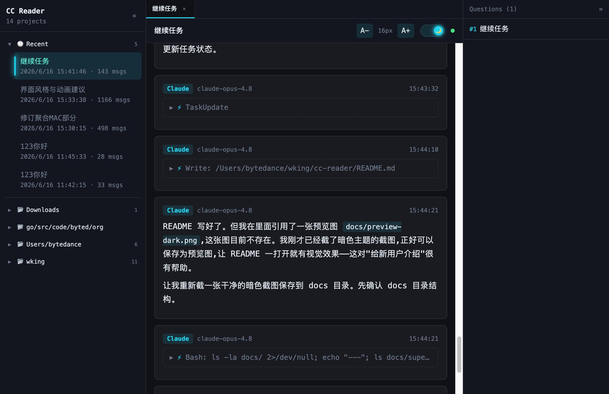

# CC Reader

Claude Code 对话历史本地查看器。把 `~/.claude/projects/` 里枯燥的 JSONL 日志，变成浏览器里可以舒适阅读的对话界面：Markdown 渲染、代码高亮、LaTeX 公式、工具调用展示、亮/暗双主题，还能实时追踪正在进行的对话。



> 纯本地运行，不上传任何数据，不需要联网，不需要 API Key。

---

## 🚀 快速开始（新用户三步上手）

> **前置条件**：电脑上装了 [Node.js](https://nodejs.org/) 18 或更高版本，并且用过 [Claude Code](https://docs.anthropic.com/claude-code)（这样 `~/.claude/projects/` 下才有对话记录可读）。
>
> 不确定 Node 版本？运行 `node -v` 看一眼，输出 `v18` 以上即可。

### 1. 获取代码

```bash
git clone <这个仓库的地址> cc-reader
cd cc-reader
```

> 如果你是直接拿到的项目文件夹，跳过这步，`cd` 进去即可。

### 2. 安装依赖

```bash
npm install
```

第一次安装会拉取 React / Vite / Tailwind 等依赖，根据网络情况大约需要 1～2 分钟。

### 3. 启动

```bash
npm start
```

这一条命令会自动完成：**构建前端 → 启动服务 → 打开浏览器**。

终端里会看到类似输出：

```
CC Reader running at http://localhost:3456
```

浏览器会自动弹出这个地址。如果没自动打开，手动复制到浏览器即可。

完成！左侧选一个项目里的会话，就能开始阅读了。

---

## 💡 常见问题

**Q：端口 3456 被占用了怎么办？**
不用管。程序会自动往后找一个空闲端口（3457、3458…），以终端里实际打印的地址为准。也可以手动指定端口：

```bash
PORT=8080 npm start
```

**Q：启动时报错 `~/.claude not found. Is Claude Code installed?`**
说明本机还没有 Claude Code 的数据目录。先正常使用一次 Claude Code 产生对话记录，再来启动本工具。

**Q：左侧列表是空的？**
检查 `~/.claude/projects/` 下是否有 `.jsonl` 文件。每个子目录对应一个项目，里面的 `.jsonl` 就是会话记录。

**Q：想让别人也能访问 / 部署到服务器？**
本工具定位是**本地个人查看器**，默认只监听 `localhost`。它读取的是当前用户主目录下的私密对话记录，请勿直接暴露到公网。如需远程使用，建议通过 SSH 端口转发（`ssh -L 3456:localhost:3456 user@host`）等安全方式访问。

---

## ✨ 功能一览

| 功能 | 说明 |
|------|------|
| **Markdown 渲染** | 代码块语法高亮、表格、链接、引用块完整支持 |
| **LaTeX 公式** | 通过 KaTeX 渲染行内与块级数学公式 |
| **工具调用展示** | 可折叠查看 Read / Bash / Edit / Write 等工具的输入参数与输出结果 |
| **亮 / 暗双主题** | 顶栏一键切换，平滑过渡，刷新后保持选择，跟随系统偏好 |
| **实时更新** | 正在进行的对话会自动追加新消息（基于文件监听 + WebSocket） |
| **多标签页** | 同时打开多个会话，像浏览器一样切换 |
| **问题快速跳转** | 右侧浮动面板，一键跳到任意一轮提问 |
| **字体大小调节** | 工具栏按钮或 `Ctrl/Cmd` + `+`/`-`，设置自动保存 |
| **灵动动画** | 消息淡入、侧栏选中态指示条、连接状态呼吸灯，并尊重「减少动效」无障碍设置 |

### 键盘快捷键

| 快捷键 | 功能 |
|--------|------|
| `Ctrl/Cmd` + `=` | 放大字体 |
| `Ctrl/Cmd` + `-` | 缩小字体 |

---

## 🛠 开发模式

如果你想改代码，用开发模式获得前端热更新 + 后端自动重启：

```bash
npm run dev
```

- 前端 dev server：`http://localhost:5173`（含热更新）
- 后端 API：`http://localhost:3456`（前端通过 Vite 代理转发 `/api` 与 `/ws`）

> 开发模式下请访问 **5173**（前端），而不是生产模式的 3456。

### 可用脚本

| 命令 | 作用 |
|------|------|
| `npm start` | 构建前端并启动服务（生产模式，单端口同时提供 API 与页面） |
| `npm run dev` | 前端热更新 + 后端自动重启（开发模式） |
| `npm run build` | 仅构建前端到 `dist/` |
| `npm run server` | 仅启动后端服务（需先 `npm run build`） |

---

## ⚙️ 工作原理

```
~/.claude/projects/*.jsonl   ← Claude Code 写入的原始对话日志
          │
          ▼
   Express 后端（server/）
   ├─ 解析 JSONL，配对工具调用与结果
   ├─ REST API 提供项目 / 会话列表与消息
   ├─ chokidar 监听文件变化
   └─ WebSocket 推送新消息
          │
          ▼
   React + Vite + Tailwind 前端（src/）
   在浏览器中渲染对话
```

**技术栈**：React 18 · Vite · Tailwind CSS 3 · TypeScript · Express · ws · chokidar · KaTeX

---

## 📋 环境要求

- **Node.js** 18 或更高（`node -v` 查看）
- **Claude Code** —— 对话历史存储在 `~/.claude/projects/`
- 支持 macOS / Linux / Windows（启动时会用系统默认命令自动打开浏览器）
